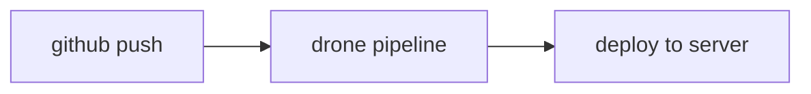

[](https://drone.respok.com/huc/project-pim)
 
 

# project-pim

Install it and run:

```sh
npm install
npm run dev
```

## About

a pim system;

- Frontend: [https://github.com/hz2/project-pim](https://github.com/hz2/project-pim)

> next.js / react + mui + typescript

- Backend: [https://github.com/hz2/project-nest](https://github.com/hz2/project-nest)

> nest.js + typeorm + mysql + graphql


## Flow chart

